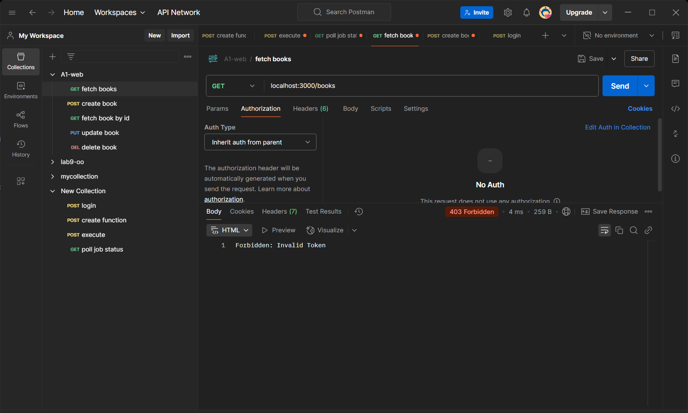
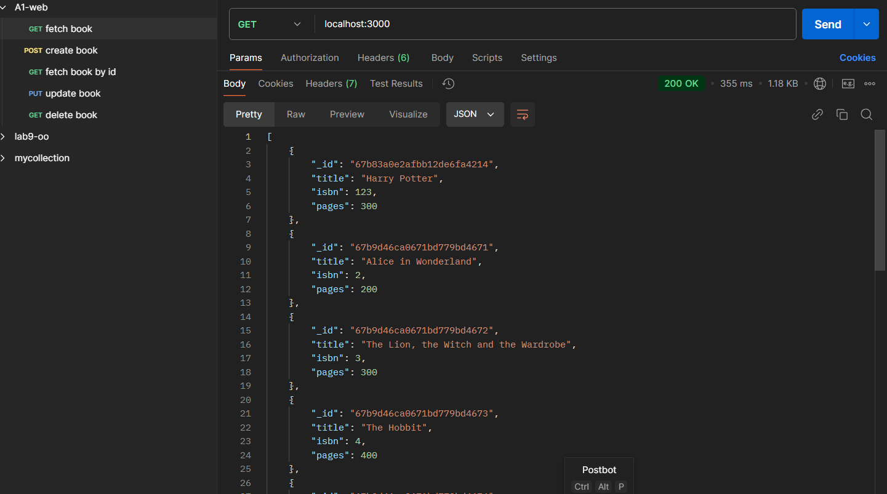
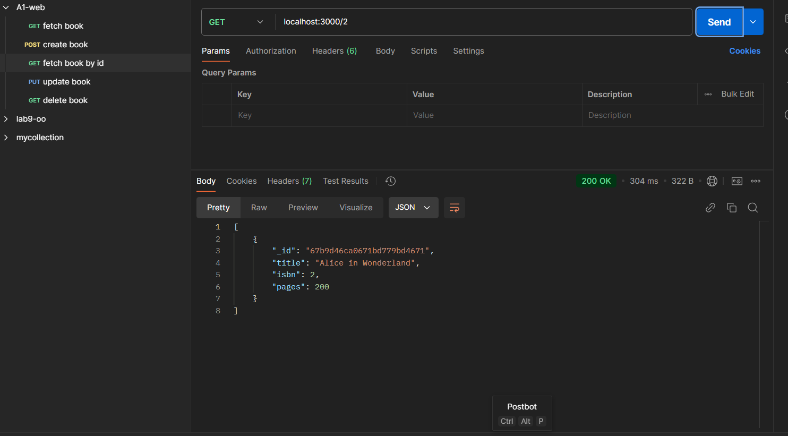
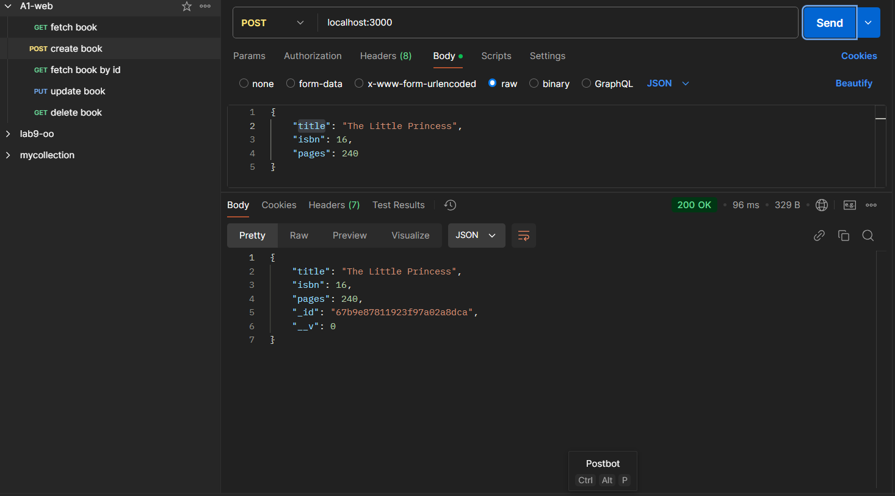
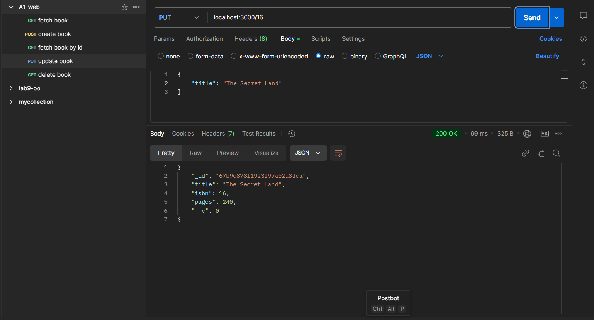
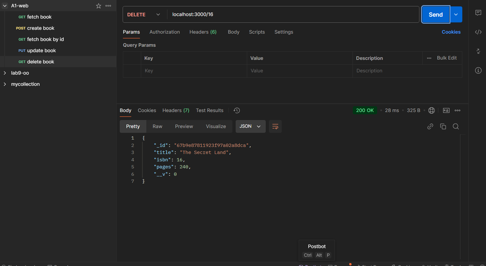
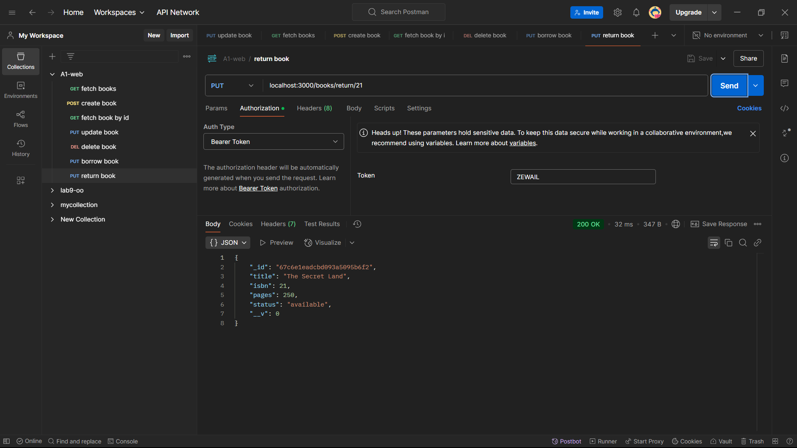
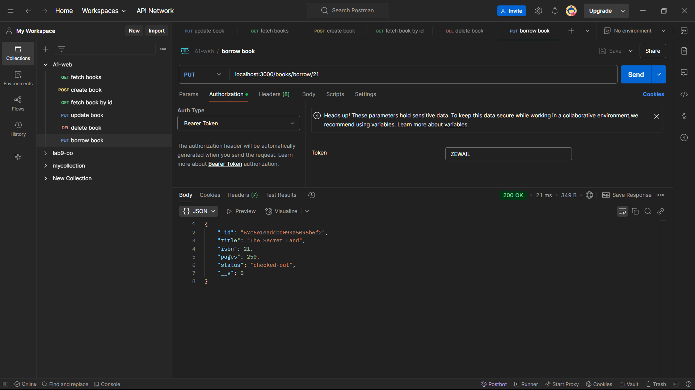

## Developing a RESTful API for managing books using MongoDB and Express.js

### Installing the program
1. Clone the repository:
    ```bash
    git clone <repository-url>
    ```
2. Install all Modules
    ```bash
    npm install
    ```
3. Install the dependencies:
    ```bash
    npm install mongoose express
    ```
4. Start the server:
    ```bash
    node server.js
    ```

### Technologies used
- Node.js
- Express.js
- MongoDB
- Mongoose
- Imported data from data.json into LabTaskDB database using MongoDB Compass.

### Postman output
1. Fetching Data Without Token



1. Fetching all Books



2. Fetching Book by ISBN

 

3. Creating Book



4. Updating Book



5. Deleting Book



6. Returning Book



7. Borrowing Book



### Resources
- [Node.js MongoDB tutorial](https://www.w3schools.com/nodejs/nodejs_mongodb_find.asp)
- [Retrieve Data from MongoDB](https://www.geeksforgeeks.org/how-to-retrieve-data-from-mongodb-using-nodejs/)
- [How to create GET and POST endpoints in NodeJS using ExpressJS?](https://medium.com/@anshmunjal/how-to-create-get-and-post-endpoints-in-nodejs-using-expressjs-77fd3953ec38)
- [Express.js Documentation](https://expressjs.com/)
- [MongoDB Documentation](https://docs.mongodb.com/)
